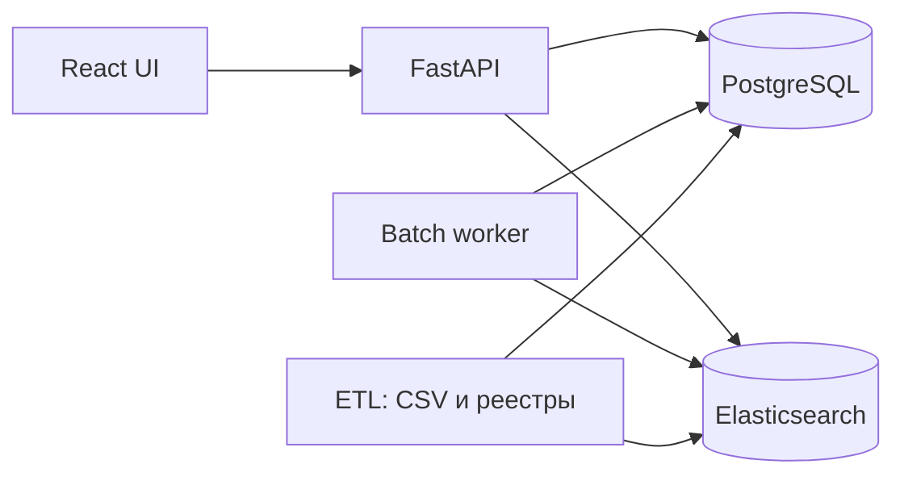

# Техническая документация: сервис подбора контрагентов

Версия 1.0, 1 октября 2026. Стек: PostgreSQL, Python (pandas/polars, scikit-learn), Elasticsearch, FastAPI, React. Без внешних API нейросетей.

## 0. Исходные решения

| Вопрос | Ответ заказчика | Следствие |
| --- | --- | --- |
| Что такое релевантный контрагент | Тот, кто побеждал в похожих закупках | Целевая метка = победа (`is_winner`). Участие без победы получает малый вес (`loss_weight`, по умолчанию 0.25, настраивается; 0 = строго только победы) |
| Вход при тестировании | Один лот в формате трёх CSV | Загрузчик принимает 3 файла; файл поставщиков может быть пустым или отсутствовать |
| Пользователь | Аналитик | Нужны таблица, фильтры, экспорт XLSX/CSV |
| Статусы | Градации нет, роли заданы | Роли строго три: производитель, дистрибьютор, поставщик (+ «не определена»). Статусы определяем сами (п. 5.4) и согласуем с заказчиком |
| Производительность | Список за 10 с; целевой режим: пакет по всем открытым закупкам | Всё тяжёлое предрасчитывается; онлайн только отбор и скоринг |
| Источники обогащения | Реестр МСП ФНС, РНП ФАС | Новых компаний можно добавлять только из реестра МСП (п. 6) |

**Допущения (проверить):** формат и актуальные адреса выгрузок реестров МСП и РНП, состав полей (ОКВЭД в реестре МСП), условия использования; состав файла «открытых закупок» для пакетного режима (предполагается тот же формат трёх CSV).

## 1. Требования

| Код | Требование |
| --- | --- |
| ФТ-1 | Вход: lot_id из базы либо три CSV с одним лотом |
| ФТ-2 | Выход: ранжированный список (по умолчанию топ-20) с оценкой, ролью, статусом, МСП-признаком, риском, разложением по факторам и лотами-доказательствами |
| ФТ-3 | Пакетный расчёт по всем открытым закупкам и экспорт XLSX/CSV |
| ФТ-4 | Расширение пула слабых категорий из реестра МСП (офлайн) |
| ФТ-5 | Исключение/пометка компаний из РНП |
| ФТ-6 | Карточка поставщика: история, роль, источники обогащения с датой |
| НФТ-1 | Онлайн-запрос ≤10 с (цель p95 ≤3 с); пакет 40 тыс. лотов ≤60 мин (цели, подтвердить замером) |
| НФТ-2 | Воспроизводимость: каждый запуск хранит версию данных, весов и кода |
| НФТ-3 | Никаких обязательных внешних сетевых сервисов в рабочей логике |
| НФТ-4 | Docker Compose, запуск одной командой |

## 2. Архитектура

Модульный монолит: один репозиторий, одно API, один воркер. Разделение на модули логическое.



| Модуль | Ответственность |
| --- | --- |
| `etl` | Загрузка 3 CSV, очистка, агрегаты, индексация в ES, загрузка реестров МСП и РНП |
| `engine` | Генерация кандидатов, факторы, скоринг, роли, статусы, объяснения |
| `api` | REST, валидация, экспорт |
| `worker` | Пакетные запуски (очередь в PostgreSQL, без брокера) |
| `ui` | Веб-интерфейс |
| `eval` | Бэктест и метрики |

Структура репозитория: `etl/`, `engine/`, `api/`, `worker/`, `ui/`, `eval/`, `config/weights.yaml`, `docker-compose.yml`.

## 3. PostgreSQL

Схемы: `raw` (как в CSV), `core` (очищенные данные), `mart` (агрегаты), `enrich` (реестры), `app` (запуски и результаты).

Загрузка: `COPY raw.* FROM ... WITH (FORMAT csv, DELIMITER ';', HEADER true)`. ИНН и КПП хранить как `text`.

```sql
CREATE TABLE core.lot (
  lot_id bigint PRIMARY KEY, publish_date date NOT NULL, title text NOT NULL,
  start_price numeric, is_smp boolean, customer_inn text, channel text);
CREATE TABLE core.lot_item (
  lot_id bigint REFERENCES core.lot, pos int, product_name text, okpd2 text, weight real,
  PRIMARY KEY (lot_id, pos));
CREATE TABLE core.participation (
  lot_id bigint REFERENCES core.lot, supplier_inn text, supplier_kpp text, is_winner boolean,
  PRIMARY KEY (lot_id, supplier_inn));
CREATE TABLE mart.supplier_okpd (
  supplier_inn text, okpd4 text, wins int, losses int, last_date date, median_price numeric,
  PRIMARY KEY (supplier_inn, okpd4));
CREATE TABLE mart.supplier (
  supplier_inn text PRIMARY KEY, is_individual boolean, region text, lots int, wins int,
  n_okpd4 int, role text, role_conf real);
CREATE TABLE enrich.msp (
  inn text PRIMARY KEY, name text, category text, okved text[], region text,
  included_at date, source_file text, fetched_at timestamptz);
CREATE TABLE enrich.rnp (
  inn text, reg_number text, date_in date, date_out date, fetched_at timestamptz,
  PRIMARY KEY (inn, reg_number));
CREATE TABLE app.run (
  run_id uuid PRIMARY KEY, kind text, status text, created_at timestamptz,
  weights jsonb, data_version text, n_lots int);
CREATE TABLE app.recommendation (
  run_id uuid, lot_id bigint, rank int, supplier_inn text, score real,
  role text, status text, factors jsonb, evidence jsonb,
  PRIMARY KEY (run_id, lot_id, rank));
```

Индексы: `participation(supplier_inn)`, `lot_item(okpd2 text_pattern_ops)`, `lot(customer_inn)`, `lot(publish_date)`.

Очистка: дубли `lot×supplier` (31) удаляются; у лотов >50 позиций остаются топ-50 по весу (максимум в данных 7 011); `reqnum` и `subject` не загружаются в `core`; лоты без записей о поставщиках (9%) остаются для поиска похожих. `weight` позиции = нормированная доля позиции в лоте. Регион по префиксу КПП; 12-значный ИНН = ИП/физлицо.

## 4. Elasticsearch

| Индекс | Документ | Поля | Назначение |
| --- | --- | --- | --- |
| `lots_hist` | лот (≈604 тыс.) | `title` (анализатор russian), `okpd2` (keyword), `okpd4` (keyword), `customer_inn`, `date`, `price`, `winner_inns` (keyword\[\]) | Поиск похожих закупок |
| `suppliers` | поставщик/компания МСП | `name`, `inn`, `region`, `okved` | Поиск по названию в UI |

Single-node, куча 2 ГБ. Индексация массово (`bulk`) после ETL.

## 5. Алгоритм (`engine`)

### 5.1 Кандидаты (до 300)

1. Запрос в `lots_hist`: `match` по `title` + `terms` по `okpd4`/`okpd2` (с повышением), фильтр `date < дата лота`, `size=200`. Победители найденных лотов становятся кандидатами.
2. SQL по `mart.supplier_okpd`: поставщики с победами по кодам лота, затем расширение вверх (группа XX.XX → класс XX.X).
3. Для слабых категорий: компании из `enrich.msp` (п. 6).

### 5.2 Факторы

`Score = 100 · M · Σ wₖ·Fₖ`, `Fₖ ∈ [0,1]`

| k | Фактор | Расчёт | Вес |
| --- | --- | --- | --- |
| F1 | Опыт в категории | `1 − exp(−E/τ)`; `E = Σ u·sim·γ^возраст` по истории кандидата; `u` = 1 победа, `loss_weight` участие без победы; `sim` = 1.0 точный код, 0.7 подкласс, 0.5 группа, 0.25 класс | 0.30 |
| F2 | Победы в текстово-похожих лотах | `Σ wᵢ·[кандидат ∈ winner_inns лота i] / Σ wᵢ`, `wᵢ` = BM25-оценка лота, нормированная на максимум | 0.20 |
| F3 | Результативность | `(wins + α·p₀)/(участий + α)` в близких категориях | 0.15 |
| F4 | Связь с заказчиком | `1 − exp(−n/2)`, `n` = победы у этого заказчика | 0.10 |
| F5 | Соответствие цене | `exp(−\|ln цена − ln медиана\|/σ)` | 0.08 |
| F6 | Актуальность | затухание по давности последней победы | 0.07 |
| F7 | География | СПб/ЛО 1.0, иное 0.5, неизвестно 0.3 | 0.05 |
| F8 | СМП | для лота СМП: МСП 1.0, не МСП 0.0, неизвестно 0.5; иначе 1.0 | 0.05 |

`M`: 0 если компания в действующей записи РНП (дата выхода пуста или в будущем); иначе `min(1, 0.6 + 0.1·лотов)`; для кандидатов только из реестра МСП `M ≤ 0.8`.

Веса, `τ, γ, α, σ, loss_weight` лежат в `config/weights.yaml` и сохраняются в `app.run.weights`.

### 5.3 Роли

Роль выставляется правилами, `role_conf` показывает уверенность. Источник «ОКВЭД» доступен только для компаний из реестра МСП.

| Роль | Сигналы |
| --- | --- |
| Производитель | ОКВЭД 10–33; слова в названии «завод, фабрика, комбинат, производств»; победы в узком наборе кодов (малое `n_okpd4`) |
| Дистрибьютор | ОКВЭД 46; слова «торг, снаб, опт, дистриб»; победы в широком наборе классов ОКПД2 (порог подобрать по распределению `n_okpd4`) |
| Поставщик | ОКВЭД 47 или иные; нет явных сигналов выше |
| Не определена | `role_conf` \< порога |

Пороги и слова калибруются ручной проверкой выборки из 50 компаний (разметка вручную, т.к. эталона нет).

### 5.4 Статусы (предложение)

| Статус | Условие |
| --- | --- |
| Проверенный | ≥3 победы по близким кодам и победа за последние 12 мес. |
| Участник | история есть, условие выше не выполнено |
| Новый (реестр МСП) | нет истории, найден через `enrich.msp` |
| Риск | запись в РНП либо `M < 0.5` |

### 5.5 Объяснение

Для каждой строки: `factors` (вклад `wₖ·Fₖ`), `evidence` (до 3 лотов: lot_id, название, ОКПД2, заказчик, победитель), фраза по шаблону («Победил в 5 закупках по ОКПД2 56.29, в т.ч. 2 у этого заказчика; МСП; в РНП не значится»).

## 6. Обогащение

| Источник | Загрузка | Использование |
| --- | --- | --- |
| Реестр МСП ФНС | Периодическая выгрузка (формат, URL, лицензию проверить); сырой файл хранится с хэшем и датой | МСП-признак, ОКВЭД, регион; пул новых компаний |
| РНП ФАС | Выгрузка реестра (актуальный источник и формат проверить) | Статус «Риск», `M = 0` |

Порядок: скачать → сохранить сырой файл → распарсить → `enrich.*` → пересчитать `mart.supplier` → переиндексировать.

**Слабая категория:** класс XX.XX с ≤5 поставщиков (19% из 586) либо с долей лидера >60% по победам. Для таких категорий отбираются компании из `enrich.msp`: регион 78/47, ОКВЭД с совпадающим префиксом XX.XX, нет в истории. Они получают F1 по ОКВЭД→ОКПД2 (сходство по префиксу), F7, F8; F2–F6 равны 0. В карточке указываются источник и дата.

**Ограничение:** в пул попадают только МСП. Крупные производители вне реестра МСП не обнаруживаются; вынести заказчику как открытый вопрос.

## 7. Пакетная обработка

1. Вход: CSV открытых закупок (тот же формат) либо выборка из `core.lot`.
2. Воркер берёт задачу из `app.run` (`status = queued`), обрабатывает порциями по 1 000 лотов.
3. Для порции: `_msearch` в ES, затем SQL-кандидаты, расчёт факторов на polars, запись в `app.recommendation`.
4. Статусы: `queued → running → done/failed`, прогресс в процентах.
5. Экспорт: `openpyxl` (XLSX) или CSV; листы «Рекомендации» и «Объяснения».

Предрасчёт: `mart.*` и роли обновляются после загрузки данных, не во время запроса.

## 8. API (FastAPI, `/api/v1`)

| Метод и путь | Назначение |
| --- | --- |
| `POST /recommendations` | Вход: `lot_id` либо multipart с тремя CSV; ответ: список |
| `GET /lots/{lot_id}` | Данные лота |
| `GET /suppliers/{inn}` | Карточка поставщика |
| `POST /batch/runs`, `GET /batch/runs/{id}` | Запуск и статус пакета |
| \`GET /batch/runs/{id}/export?format=xlsx | csv\` |
| `POST /enrichment/refresh` | Обновление реестров (админ) |
| `GET /health` | Проверка |

```json
{"lot_id": 4652711, "run_id": "…", "took_ms": 2100,
 "items": [{"rank": 1, "inn": "7804428656", "name": null, "score": 78.4,
   "role": "поставщик", "role_conf": 0.6, "status": "Проверенный", "msp": true,
   "risk": false, "factors": {"F1": 0.24, "F2": 0.11},
   "evidence": [{"lot_id": 4590001, "okpd2": "33.12.1", "customer_inn": "7814096706"}],
   "explain": "Победил в 5 закупках по ОКПД2 33.12 …"}]}
```

Ошибки: 400 для неверного формата CSV (с указанием файла и колонки), 404 нет лота, 422 валидация.

## 9. UI (React + TypeScript)

Vite, TanStack Query и Table, Recharts.

| Экран | Содержание |
| --- | --- |
| Вход | Поле lot_id и загрузка трёх CSV |
| Результат | Карточка закупки, таблица рекомендаций (ранг, ИНН/название, оценка, роль, статус, МСП, риск), фильтры по роли и статусу, раскрытие: столбчатая диаграмма факторов и лоты-доказательства, кнопка «Экспорт» |
| Поставщик | Профиль, победы по категориям, источники обогащения с датой |
| Пакеты | Список запусков, прогресс, скачивание |

## 10. Тестирование и метрики

| Что | Как |
| --- | --- |
| Данные | Тесты на дубли, ключи, формат ИНН, рост числа строк между слоями |
| Алгоритм | Юнит-тесты `sim`, факторов, ролей; детерминированность |
| Качество | Временной сплит: статистика по лотам до 2025-07-01, проверка на 2025-H2. Hit@10, nDCG@10, MRR по фактическим победителям. Baseline: «топ побеждавших в этом ОКПД2» |
| Производительность | 100 случайных лотов: p50/p95 времени; пакет 1 000 лотов |
| E2E | Сценарий «три CSV → список → экспорт» |

Приёмка: система превосходит baseline по nDCG@10; онлайн-запрос ≤10 с; пакет завершается без ошибок; экспорт открывается в Excel.

## 11. Развёртывание

`docker-compose.yml`: `postgres`, `elasticsearch` (single-node), `api`, `worker`, `ui` (nginx). Переменные в `.env`. Рекомендуемо ≥8 ГБ ОЗУ, ES-куча 2 ГБ. Бэкап: `pg_dump` по расписанию. Доступ: HTTPS при внешнем развёртывании, базовая авторизация для админ-эндпоинтов.

## 12. План и риски

| Этап | Результат |
| --- | --- |
| 1 | ETL + схема + F1, API и простая страница; сквозной путь |
| 2 | ES, F2–F4, объяснения, бэктест |
| 3 | Реестры МСП и РНП, роли, статусы, F7–F8 |
| 4 | UI, пакет, экспорт |
| 5 | Настройка весов, нагрузка, документация |

| Риск | Мера |
| --- | --- |
| Формат реестров отличается от ожидаемого | Парсер за интерфейсом, тестовый образец |
| Роли определяются слабо без ОКВЭД | Показывать `role_conf`, «не определена» |
| Нет эталонной разметки | Бэктест по фактическим победам |
| Сигнал разрежен (медиана 1 участник) | Сглаживание, лоты-доказательства |
| Медленный пакет | Порции, `_msearch`, предрасчёт `mart` |